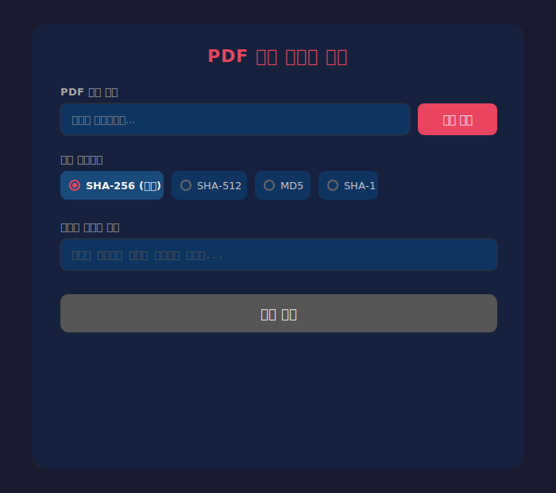
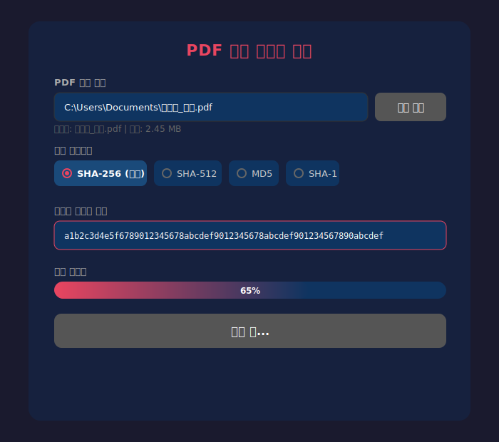
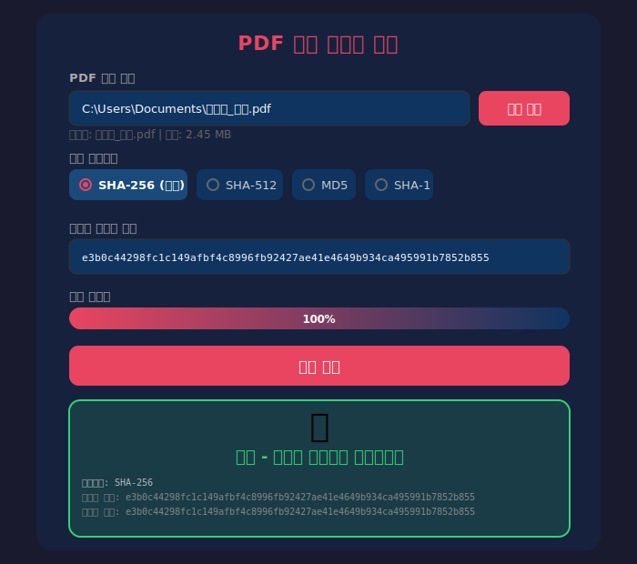
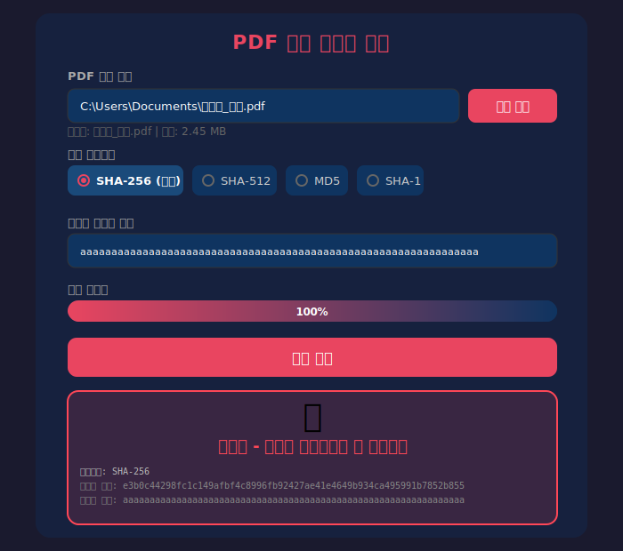

# PDF 해시 위변조 검증 프로그램

PDF 파일의 해시값을 계산하여 원본 해시와 비교함으로써 파일의 위변조 여부를 검증하는 데스크톱 애플리케이션입니다.

Electron 기반으로 Windows / Linux / macOS에서 실행 가능합니다.

---

## 실행 화면

### 1. 초기 화면

프로그램을 실행하면 아래와 같은 화면이 표시됩니다.



| 영역 | 설명 |
|------|------|
| **PDF 파일 선택** | "파일 찾기" 버튼을 클릭하여 검증할 PDF 파일을 선택합니다 |
| **해시 알고리즘** | SHA-256(권장), SHA-512, MD5, SHA-1 중 선택합니다 |
| **비교할 해시값 입력** | 원본에서 제공받은 해시값을 붙여넣기 합니다 |
| **검증 시작 버튼** | 파일과 해시값이 모두 입력되면 활성화됩니다 |

---

### 2. 검증 진행 중

"검증 시작" 버튼을 클릭하면 프로그레스바가 나타나며 해시 계산 진행률을 실시간으로 표시합니다.



- 스트림 기반으로 대용량 PDF 파일도 메모리 부담 없이 처리합니다
- 검증 중에는 버튼이 비활성화되어 중복 실행을 방지합니다

---

### 3. 검증 결과 - 일치 (정상)

계산된 해시값과 입력된 해시값이 **일치**하면 녹색 결과 영역이 표시됩니다.



- **녹색 배경 + 체크 아이콘**: 파일이 변조되지 않았음을 의미합니다
- 하단에 사용된 알고리즘, 계산된 해시, 입력된 해시를 상세히 표시합니다

---

### 4. 검증 결과 - 불일치 (위변조 의심)

계산된 해시값과 입력된 해시값이 **불일치**하면 빨간색 결과 영역이 표시됩니다.



- **빨간색 배경 + X 아이콘**: 파일이 변조되었을 가능성이 있음을 경고합니다
- 두 해시값을 비교하여 어떻게 다른지 확인할 수 있습니다

---

## 지원 해시 알고리즘

| 알고리즘 | 출력 길이 | 보안성 | 권장 여부 |
|----------|-----------|--------|-----------|
| **SHA-256** | 64자 | 높음 | **권장** |
| SHA-512 | 128자 | 매우 높음 | 선택 |
| SHA-1 | 40자 | 보통 | 비권장 (레거시 호환) |
| MD5 | 32자 | 낮음 | 비권장 (레거시 호환) |

> SHA-256은 현재 파일 무결성 검증의 업계 표준으로, 충돌 저항성이 뛰어나고 대부분의 공식 배포처에서 사용됩니다.

---

## 설치 및 실행

### 소스에서 실행

```bash
# 의존성 설치
npm install

# 개발 모드 실행
npm start
```

### 빌드 (설치 파일 생성)

```bash
# Windows (.exe)
npm run build

# Linux (.AppImage)
npx electron-builder --linux AppImage
```

빌드된 파일은 `dist/` 폴더에 생성됩니다.

---

## 프로젝트 구조

```
pdf-hash/
├── main.js          # Electron 메인 프로세스 (파일 다이얼로그, 해시 계산)
├── preload.js       # 보안 컨텍스트 브릿지 (IPC 통신)
├── index.html       # UI 레이아웃 및 스타일
├── renderer.js      # 프론트엔드 로직 (검증 흐름 제어)
├── package.json     # 의존성 및 빌드 설정
└── docs/            # 실행 화면 이미지
```

---

## 사용 시나리오

1. 계약서, 증명서 등 중요 PDF 파일을 수신합니다
2. 발신자로부터 해당 파일의 SHA-256 해시값을 별도 채널로 전달받습니다
3. 본 프로그램에서 PDF 파일을 선택하고, 전달받은 해시값을 입력합니다
4. "검증 시작"을 클릭하여 일치 여부를 확인합니다
5. **일치** 시 원본 그대로임이 확인되며, **불일치** 시 위변조 가능성을 의심합니다
